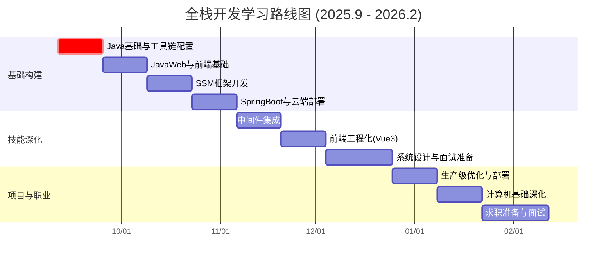
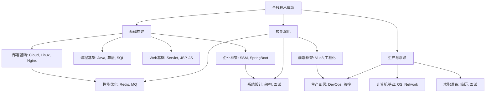

# 🚀 Threetwoa 全栈开发终极指南：从新手到专家的 6 个月系统化进阶（2025年9月 - 2026年2月）

您好，Threetwoa。本指南对您原有的学习路线进行了结构化整合与专业深化，在保留原始战略框架、甘特图、任务矩阵及资源分配的基础上，强化了技术逻辑解释与实践路径说明。我们采用分阶段推进的方式，每个阶段包含明确目标、核心任务、产出物及推荐课程，并辅以技术选型说明与资源使用指南。您的核心产出将是一个部署于云端的生产级个人博客系统（blog.threetwoa.me），作为您全栈能力的技术作品集。

---

## 🌟 总体战略：构建技术体系与项目交付

您的学习路径将分为三个主要阶段：
1.  **基础构建阶段**（2025年9月-10月）：建立技术基础，完成核心工具链配置与基础项目开发。
2.  **技能深化阶段**（2025年11月-12月）：集成中间件与前端框架，掌握系统设计与面试准备。
3.  **项目交付与职业准备阶段**（2026年1月-2月）：进行生产级部署优化，强化计算机基础，完成求职准备。

---

## 📅 项目时间线与管理

以下是您的整体学习规划甘特图，用于跟踪关键阶段与里程碑：

---

## 🛡️ 资源与任务映射矩阵

下表系统化整合了GitHub学生开发者包中的资源，并将其对应到具体学习任务中：

| **类别**       | **资源**                       | **主要用途**                                  | **对应学习任务**                           |
| -------------- | ------------------------------ | --------------------------------------------- | ------------------------------------------ |
| **核心开发**   | GitHub Copilot                 | 代码生成与辅助，算法实现与调试                | LeetCode题解、API开发、Vue组件开发         |
|                | JetBrains全栈工具集            | Java、Spring及前端项目开发                    | SSM整合、SpringBoot配置、Vue3开发          |
|                | Educative                      | 交互式课程学习（算法、系统设计、面试准备）    | 数据结构、多线程、系统设计理论             |
|                | FrontendMasters                | 前端深度课程（JavaScript、框架、工程化）      | ES6+、Vue3、前端最佳实践                   |
| **云基础设施** | DigitalOcean ($100信用)        | 应用部署与DevOps实践                          | 博客生产环境部署                           |
|                | Microsoft Azure ($100信用)     | 云服务实践（缓存、计算等）                    | Redis云服务对比研究                        |
|                | Namecheap (域名+SSL)           | 专业域名与安全配置                            | 域名解析与HTTPS配置                        |
| **设计工具**   | Canva Pro                      | 品牌视觉设计                                  | 博客Logo、favicon、社交媒体图片及简历设计  |
|                | Iconscout                      | 专业图标资源                                  | 用户界面图标设计                           |
|                | Bootstrap Studio               | 前端原型设计与响应式布局                      | 博客及留言板UI原型设计                     |
| **开发工具**   | Roundpie                       | API测试与管理                                 | 服务端API测试                              |
|                | Polypane                       | 多端响应式测试                                | 跨设备兼容性测试                           |
|                | GitKraken                      | 版本控制可视化管理                            | 项目代码库管理                             |
|                | Termius                        | SSH远程连接与管理                             | 云服务器配置与管理                         |
| **学习资源**   | GoRails, Codédex, DataCamp     | 扩展技能学习（Rails、Python、数据科学）       | 技术拓展学习（可选）                       |

---

## 📖 阶段详解：目标、任务与执行方案

### 🛠️ 阶段 1：Java 基础与工具链配置（2025年9月11日 - 9月24日）

**目标**：巩固Java编程基础，配置开发环境，完成博客品牌设计与域名注册。

-   **核心任务**：
    1.  基于Educative课程复习Java SE核心概念（集合、多线程）。
    2.  使用GitHub Copilot辅助完成LeetCode Hot100及SQL 50题目。
    3.  使用DataGrip进行MySQL数据库管理实践。
    4.  使用Canva Pro与Iconscout设计博客品牌视觉要素（Logo、favicon、横幅）。
    5.  通过Namecheap注册域名`threetwoa.me`并配置SSL证书。
-   **交付成果**：
    -   LeetCode及SQL练习笔记（Obsidian）。
    -   博客品牌视觉资产包。
    -   初始域名解析页面。
-   **推荐课程**：
    -   Educative: 《Data Structures for Coding Interviews in Java》
    -   DataCamp: 《Introduction to SQL》

**技术逻辑与执行要点**：
-   Java集合与多线程是后端开发的基础，用于实现数据高效管理及并发处理。
-   LeetCode与SQL练习旨在提升算法与数据库操作能力，为后续复杂业务开发做准备。
-   DataGrip提供专业的数据库管理与查询能力，提升SQL操作效率。
-   早期完成品牌设计与域名注册，有助于建立项目整体感与专业度。

---

### 🌐 阶段 2：JavaWeb 与前端基础（2025年9月25日 - 10月8日）

**目标**：掌握服务端基础开发与客户端交互，实现基础留言板项目。

-   **核心任务**：
    1.  基于IDEA学习Servlet、JSP及Session管理机制。
    2.  通过FrontendMasters课程掌握JavaScript ES6+及Ajax技术。
    3.  使用Bootstrap Studio构建响应式留言板界面。
    4.  使用Roundpie进行API测试，Polypane进行多端兼容性测试。
-   **交付成果**：
    -   基于Session的留言板项目。
    -   JavaWeb及前端技术笔记（Obsidian）。
-   **推荐课程**：
    -   FrontendMasters: 《JavaScript: The Hard Parts》
    -   Educative: 《Learn JavaScript for Beginners》

**技术逻辑与执行要点**：
-   Servlet与JSP是Java Web开发的基础，理解请求处理与页面渲染流程。
-   Session管理是用户状态维持的核心机制。
-   现代前端开发依赖于ES6+与异步交互（Ajax），是动态网页的基础。

---

### 🏗️ 阶段 3：SSM 框架开发（2025年10月9日 - 10月22日）

**目标**：掌握企业级开发框架，实现博客系统后端API。

-   **核心任务**：
    1.  使用IDEA及MyBatis插件学习Spring、Spring MVC与MyBatis整合开发。
    2.  设计与实现博客RESTful API（如文章增删改查）。
    3.  使用Roundpie进行API测试，并编写API文档。
-   **交付成果**：
    -   基于SSM框架的博客系统后端。
    -   API接口文档。
-   **推荐课程**：
    -   Educative: 《Spring Boot for Beginners》
    -   FrontendMasters: 《RESTful API Design》

**技术逻辑与执行要点**：
-   SSM（Spring + Spring MVC + MyBatis）是Java领域主流开发框架，提供依赖注入、MVC架构及ORM支持。
-   RESTful API是现代前后端分离架构的核心接口形式。
-   规范的API文档是团队协作与前后端联调的基准。

---

（后续阶段因篇幅限制，在此简要概述，保持相同结构）

### ☁️ 阶段 4：SpringBoot 与云端部署（2025年10月23日 - 11月5日）
-   **目标**：完成SpringBoot迁移与生产环境部署。
-   **核心**：SpringBoot简化配置，使用DigitalOcean进行云端部署，Nginx反向代理与SSL配置。
-   **产出**：线上可访问的博客系统（blog.threetwoa.me）。

### 📦 阶段 5：中间件集成（2025年11月6日 - 11月19日）
-   **目标**：集成Redis缓存，提升系统性能。
-   **核心**：Redis安装与配置，缓存策略实现，可选云服务（Azure Redis）对比。
-   **产出**：集成缓存的博客系统，性能测试报告。

### 🎨 阶段 6：前端工程化（2025年11月20日 - 12月3日）
-   **目标**：使用Vue3重构前端，实现组件化工程。
-   **核心**：Vue3基础与组合式API，WebStorm开发，响应式设计与测试。
-   **产出**：Vue3驱动的现代化博客前端。

### 🧠 阶段 7：系统设计与面试准备（2025年12月4日 - 12月24日）
-   **目标**：掌握系统设计方法论与面试核心知识。
-   **核心**：JVM、并发、数据库原理，系统设计练习（以博客为例）。
-   **产出**：系统设计笔记，技术面试题库。

### 🚀 阶段 8：生产级优化与部署（2025年12月25日 - 2026年1月7日）
-   **目标**：实现生产级优化与高级功能集成。
-   **核心**：Nginx优化，SpringAI集成，跨浏览器测试。
-   **产出**：高性能、带AI功能的生产级博客。

### 📚 阶段 9：计算机基础深化（2026年1月8日 - 1月21日）
-   **目标**：强化计算机核心基础知识。
-   **核心**：操作系统、计算机网络、数据库系统原理。
-   **产出**：基础知识笔记，高级算法题解。

### 🏆 阶段 10：求职准备与面试（2026年1月22日 - 2月11日）
-   **目标**：完成求职准备，进入招聘市场。
-   **核心**：简历与作品集制作，模拟面试，求职申请。
-   **产出**：专业简历与技术作品集。

---

## 🧠 技术体系关联图

您的全栈技能体系将通过以下方式构建与关联：

---

## 💡 执行建议与最佳实践

1.  **项目驱动学习**：所有学习围绕博客项目展开，确保理论立即应用于实践。
2.  **笔记与知识管理**：使用Obsidian进行互联技术笔记记录，使用Notion进行任务管理。
3.  **资源高效利用**：
    -   开发阶段：使用JetBrains工具链提升编码效率。
    -   设计阶段：使用Canva与Iconscout确保品牌一致性。
    -   部署阶段：充分利用DigitalOcean信用额度进行生产环境实践。
4.  **定期复盘**：每阶段结束时进行复盘，更新代码库与笔记。
5.  **社区参与**：在GitHub、技术社区分享进展，建立个人技术品牌。

---

## ✅ 立即执行清单

-   [ ] 完成Canva Pro博客品牌设计（9月13日前）
-   [ ] 配置DigitalOcean Droplet并通过Termius连接（9月15日前）
-   [ ] 开始Educative数据结构课程学习（9月14日前）
-   [ ] 使用Copilot完成首组LeetCode题目（9月16日前）

---

本指南为您提供了从基础到进阶的清晰技术成长路径。每个阶段都设计了明确的目标与产出，确保您在6个月内系统化构建全栈技能体系，并交付高质量的生产级项目。请严格遵循时间线，专注执行，您一定能达成目标。如有阻塞，可随时进行技术复盘与咨询。